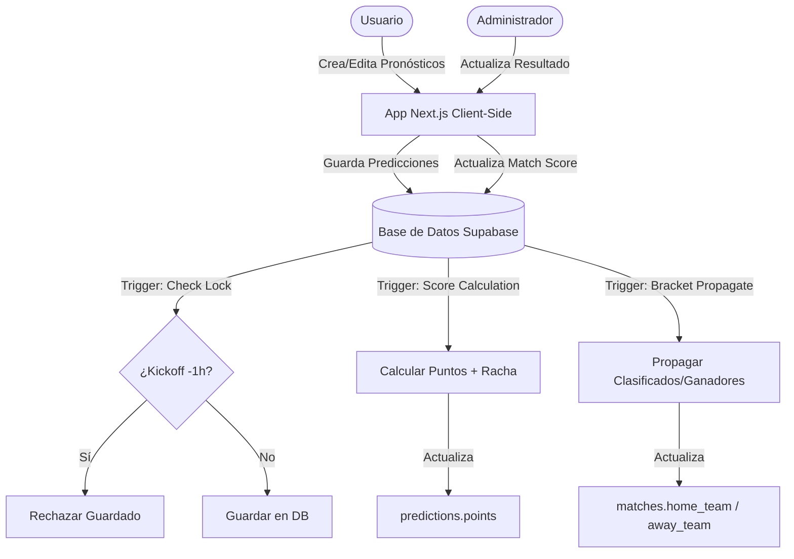

# 📝 Plan de Implementación - Quiniela del Mundial 2026

Este documento detalla el estado actual del desarrollo de la Quiniela del Mundial 2026, las fases de implementación completadas, el diseño de la arquitectura modular y las verificaciones técnicas realizadas.

---

## 📌 Estado de las Fases del Proyecto

- [x] **Fase 1: Inicialización e Infraestructura de Base de Datos**
  - Creación de tablas principales en Supabase (`matches`, `predictions`, `user_logins`).
  - Configuración del fixture de los 104 partidos del Mundial 2026 en `setup_and_seed.sql`.
  - Establecimiento de políticas de Row Level Security (RLS) en PostgreSQL.

- [x] **Fase 2: Autenticación de Usuarios**
  - Integración con Supabase Auth (Sign-up, Login, Reset de password).
  - Configuración de metadatos de usuario (`recovery_email` para recibir resultados diarios).
  - Filtro automático de vistas según la sesión activa.

- [x] **Fase 3: Reglas de Negocio en Base de Datos (Triggers)**
  - **Trigger de Puntuación (`trigger_update_prediction_points`):**
    - 5 puntos por marcador exacto.
    - 3 puntos por acertar ganador/perdedor (excepto empates).
    - 1 punto por acertar un empate no exacto.
    - Multiplicador de racha (x1.5 puntos) si el usuario viene de puntuar en 3 o más partidos consecutivos.
  - **Trigger de Cierre de Apuestas (`trigger_check_prediction_lock`):**
    - Bloquea inserciones o actualizaciones de marcadores menos de 1 hora antes de la fecha y hora de inicio del partido.
  - **Trigger de Avance del Torneo (`trigger_propagate_bracket`):**
    - Al finalizar los 72 partidos de grupos, calcula las posiciones y avanza a los 1º y 2º lugares de cada grupo, más los 8 mejores terceros.
    - Al finalizar partidos de octavos, cuartos y semis, propaga automáticamente los nombres de los ganadores (y perdedores en semis) a las llaves siguientes.

- [x] **Fase 4: Dashboard Principal y Vistas de Usuario**
  - Implementación de la vista de predicciones ordenada por días.
  - Carousel de calendario general con estatus de partidos.
  - Carousel dinámico de los Grupos A al L mostrando las tablas de posiciones calculadas en tiempo real.
  - Vista de estadísticas de usuario (pronósticos completados, puntos, rachas, cambio de contraseña).
  - Tablas de clasificación general y desglose por fases (Fase 1 a 6).
  - Vista Head-to-Head (H2H) para comparar el rendimiento exacto de dos usuarios seleccionados.

- [x] **Fase 5: Modularización del Frontend (Refactorización Principal)**
  - Extracción de la página gigante única `app/page.tsx` (3,397 líneas) en componentes más pequeños y limpios.
  - Separación de funciones utilitarias en TypeScript puro dentro de `lib/`.
  - Estructuración de interfaces de tipado robusto.

- [x] **Fase 6: Utilidades del Panel de Administración**
  - Capacidad para simular resultados aleatorios para todo el mundial para comprobar la propagación.
  - Creación y borrado de usuarios Dummy de prueba con datos simulados.
  - Envío automático de correo con el resumen diario de resultados utilizando **Resend** (invocando la API `/api/send-daily-results` y filtrando por correo de recuperación).
  - Sincronización en vivo con API externa `api.football-data.org`.

- [x] **Fase 7: Pruebas y Validación**
  - Corrección de tipados y compilación estricta de TypeScript.
  - Pruebas manuales de la lógica de desempate de terceros lugares.

- [x] **Fase 8: Soporte de Aplicación Web Progresiva (PWA)**
  - Configuración de manifiesto de la aplicación (`public/manifest.json`).
  - Configuración de Service Worker (`public/sw.js`) para soporte offline y almacenamiento en caché.
  - Configuración de iconos para dispositivos iOS/Android en `public/icons/` y enlace en `app/layout.tsx`.
  - Instrucciones integradas en la app para la instalación en pantalla de inicio de dispositivos móviles.

- [x] **Fase 9: Sistema de Notificaciones en Tiempo Real (In-App & Rachas)**
  - Creación de la tabla `notifications` y sus políticas de seguridad RLS.
  - Implementación del trigger `generate_match_notifications` en PostgreSQL para automatizar la creación de alertas al terminar partidos.
  - Notificaciones específicas al iniciar, mantener o romper rachas "On Fire" (multiplicador x1.5).
  - Componente de interfaz de usuario `NotificationBell` con suscripción activa a Supabase Realtime para recibir avisos sin recargar la página.

- [x] **Fase 10: Módulo de Trivia Diaria (Gamificación)**
  - Tablas de base de datos para preguntas y respuestas diarias (`trivia_questions` y `trivia_answers`) con políticas RLS y triggers de seguridad.
  - Funciones RPC (`get_today_trivia`, `submit_trivia_answer`, `get_trivia_stats`) para proteger las respuestas correctas antes de ser respondidas.
  - Carga masiva (seed) de 30 preguntas de trivia del torneo y del fútbol mundial.
  - Componente interactivo `TriviaView` integrado en el Dashboard.
  - Modificación de las funciones del Leaderboard (`get_leaderboard` y `get_leaderboard_by_phase`) para integrar los puntos obtenidos en la trivia (+2 por acierto) al cómputo total y por fases.

- [x] **Fase 11: Utilidades y Mejoras de Calidad de Vida (QoL)**
  - Exportación de la tabla de clasificación de fases como imagen PNG utilizando `html-to-image` y Web Share API para fácil compartición (ej. WhatsApp).
  - Adaptación de la zona horaria del mundial al huso horario de América/Costa_Rica (UTC-6).
  - Proxy y feed de RSS (`/rss`) con plantilla HTML enriquecida para ver resultados diarios.
  - Actualización de Makefile para automatizar operaciones de inicio, detención y limpieza del servidor Next.js.

---

## 🛠️ Arquitectura de Software

La aplicación sigue una arquitectura desacoplada donde la lógica de negocio pesada está delegada en PostgreSQL y la interfaz web se comporta como un consumidor reactivo e interactivo.

### Modelo de Flujo de Datos



### Contratos de Componentes Refactorizados

Durante la refactorización de `app/page.tsx`, se aislaron componentes que reciben su estado mediante `Props`:

1.  **`MatchCard`**: Renderiza tarjetas de partidos, controla el formulario de predicciones de goles y desactiva la edición si el partido está bloqueado o finalizado.
2.  **`AdminView`**: Reúne las herramientas de simulación, logs de logins diarios y envío de correos por Resend.
3.  **`StatsView`**: Panel individual del usuario que computa sus puntos, muestra su estado "on fire" y gestiona el cambio de contraseña.
4.  **`GroupsView`**: Permite alternar entre los grupos A-L, leyendo el fixture activo para recalcular y pintar las tablas de posiciones locales.
5.  **`ScheduleView`**: Visualiza la programación del fixture organizada por días de torneo.
6.  **`PhasesView`**: Tabla de clasificación desglosada que consulta `get_leaderboard_by_phase()` en Supabase.
7.  **`H2HView`**: Permite seleccionar a un rival y cruzar predicciones para ver quién acertó más partidos.
8.  **`NotificationBell`**: Gestiona las notificaciones en tiempo real, mostrándolas en un panel flotante de campana con estado de no leídos.
9.  **`TriviaView`**: Despliega la trivia de fútbol diaria, gestiona el envío de respuestas a Supabase RPC y muestra el estado y las estadísticas de racha de trivia del usuario.

---

## 📋 Verificación Técnica y Calidad

Para asegurar la estabilidad del software tras las refactorizaciones y cambios:

1.  **Prueba de Tipado:** Ejecución del compilador de TypeScript sin emisión para validar la coherencia de interfaces de props:
    ```bash
    npx tsc --noEmit
    ```
2.  **Prueba de Construcción:** Ejecución del build de Next.js para validar la optimización estática del servidor:
    ```bash
    npm run build
    ```
3.  **Seguridad RLS:** Verificación de que usuarios sin autenticar o con tokens expirados sean bloqueados al intentar insertar en `predictions` mediante las políticas de Supabase.
