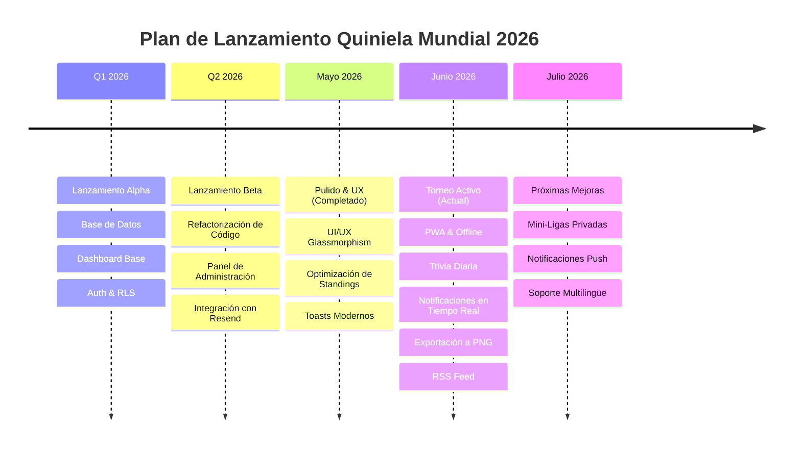

# 🗺️ Roadmap - Quiniela del Mundial 2026

Este documento detalla el mapa de ruta (roadmap) para las próximas mejoras, optimizaciones y adición de nuevas características para la aplicación **Quiniela del Mundial 2026**.

---

## 📅 Línea de Tiempo del Roadmap

---

## ✅ Hitos Completados (Junio 2026)

### 📱 1. Soporte de Aplicación Web Progresiva (PWA)
*   **Estado:** Completado 🚀
*   **Detalles:**
    *   Configuración de `manifest.json` y service worker (`sw.js`) para carga offline.
    *   Iconos de marca diseñados e integrados para compatibilidad con iOS (Apple Touch Icons) y Android.
    *   Flujo e instrucciones para instalar la aplicación directamente en la pantalla de inicio desde Safari (iOS Share) y Chrome (Android).

### 🔔 2. Sistema de Notificaciones en Tiempo Real (In-App)
*   **Estado:** Completado 🚀
*   **Detalles:**
    *   Tabla de `notifications` con políticas RLS para garantizar la privacidad.
    *   Trigger en PostgreSQL para generar notificaciones automáticamente al finalizar cada partido, indicando si el usuario acertó marcador exacto, ganador, empate o si falló.
    *   Notificaciones para el inicio, mantenimiento o ruptura de rachas "On Fire" (multiplicador x1.5).
    *   Componente `NotificationBell` interactivo que se suscribe en tiempo real a Supabase Realtime para recibir alertas instantáneas.

### 🧠 3. Módulo de Trivia Diaria (Gamificación)
*   **Estado:** Completado 🚀
*   **Detalles:**
    *   Trivia interactiva integrada en el Dashboard mediante `TriviaView`.
    *   RPCs seguros en Supabase para evitar filtraciones de respuestas antes de responder.
    *   Banco inicial de 30 preguntas de trivia histórica y del Mundial de la FIFA 2026.
    *   Integración directa de los puntos ganados (+2 por acierto) en el Leaderboard General y por Fases.

### 🖼️ 4. Exportación del Leaderboard y Feed RSS
*   **Estado:** Completado 🚀
*   **Detalles:**
    *   Botón para exportar la tabla de desgloses por fases como imagen PNG usando `html-to-image` y Web Share API para compartir directamente en redes y chats (WhatsApp/Telegram).
    *   Endpoint de RSS `/rss` dinámico con caché optimizada y plantillas HTML para la visualización fluida del fixture y los marcadores de las últimas 48 horas.
    *   Ajuste global a la zona horaria `America/Costa_Rica` (UTC-6) en toda la lógica de negocio y base de datos.

---

## 🚀 Fase 1: Próximas Características Sociales y Gamificación (Corto Plazo)

*   **Línea de Tiempo:** Fines de Junio 2026
*   **Objetivos:** Fomentar la competitividad y la retención del usuario mediante funciones de socialización.

### Características Planificadas:
1.  **Mini-Ligas / Grupos Privados:**
    *   Permitir a los usuarios crear ligas cerradas (por ejemplo: "Colegas de Oficina", "Familia Calderón", etc.) mediante un código de invitación único.
    *   Cada grupo privado tendrá su propia clasificación filtrada en tiempo real.
2.  **Muro de Comentarios / Chat de Partido:**
    *   Integrar un sistema de mensajería básico o sala de chat en tiempo real por cada tarjeta de partido (utilizando Supabase Realtime) para debatir predicciones y celebrar goles en vivo.
3.  **Insignias y Logros (Badges):**
    *   Premiar hitos específicos de los jugadores:
        *   🏆 *El Nostradamus:* Acertar 3 marcadores exactos consecutivos.
        *   🔥 *Invicto:* Puntuar en toda una jornada de partidos.
        *   ⚡ *Último Minuto:* Guardar una predicción a menos de 10 minutos del bloqueo de tiempo.

---

## 📱 Fase 2: Canales de Alerta Adicionales (Mediano Plazo)

*   **Línea de Tiempo:** Antes de comenzar la Ronda de 32 (Julio 2026)
*   **Objetivos:** Automatizar los canales de recordatorio de apuestas y alertas push fuera de la app.

### Características Planificadas:
1.  **Notificaciones Push en Navegador (Web Push):**
    *   Enviar notificaciones automáticas 2 horas antes de que comience una tanda de partidos si el usuario aún tiene predicciones pendientes por registrar.
2.  **Bot de Telegram o WhatsApp:**
    *   Integración opcional para recibir alertas de goles en tiempo real, avisos de bloqueo de tiempo y resúmenes diarios de puntuación directo en su app de mensajería favorita.

---

## 🌐 Fase 3: Expansión de Producto (Largo Plazo / Visión a Futuro)

*   **Línea de Tiempo:** Post-Mundial 2026
*   **Objetivos:** Reutilizar la base del software para crear una plataforma multitorneo.

### Características Planificadas:
1.  **Soporte Multilingüe Completo:**
    *   Internacionalización completa (i18n) de la UI para poder alternar de manera instantánea entre Español, Inglés y Francés.
2.  **Quinielas Genéricas / Multitorneo:**
    *   Rediseñar la estructura de base de datos para dar soporte a ligas locales (LaLiga, Champions League, Liga MX, Premier League) u otros torneos mundiales (Copa América, Eurocopa, Mundial Femenino).
