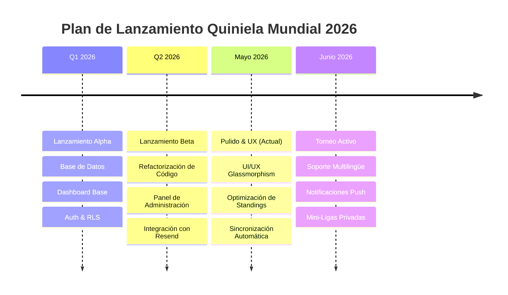

# 🗺️ Roadmap - Quiniela del Mundial 2026

Este documento detalla el mapa de ruta (roadmap) para las próximas mejoras, optimizaciones y adición de nuevas características para la aplicación **Quiniela del Mundial 2026**.

---

## 📅 Línea de Tiempo del Roadmap

---

## 🚀 Fase 1: Pulido Visual y UX (Corto Plazo - Inmediato)

*   **Línea de Tiempo:** Junio 2026 (Antes del inicio del Mundial)
*   **Objetivos:** Refinar la experiencia del usuario y optimizar la velocidad de carga en dispositivos móviles.

### Tareas Prioritarias:
1.  **Notificaciones Toast Modernas:**
    *   Reemplazar las alertas nativas del navegador por un sistema de toasts animado y elegante (ej. `react-hot-toast` o alertas integradas con Tailwind) al guardar predicciones o cambiar contraseñas.
2.  **Sincronización Automatizada (Cron Jobs):**
    *   Configurar un cron job (ej. Vercel Cron o GitHub Actions) que invoque la ruta de API `/api/sync-matches` de manera periódica (cada 15 minutos en días de partido) para automatizar la bajada de resultados oficiales sin intervención del administrador.
3.  **Animaciones Micro-interactivas:**
    *   Añadir pequeños estados de carga ("Skeleton Loaders") en las tarjetas de partidos al guardar predicciones.
    *   Efectos de chispas o fuegos artificiales visuales cuando el usuario entra en estado **"On Fire"** (racha de aciertos).

---

## 👥 Fase 2: Características Sociales y Gamificación (Mediano Plazo)

*   **Línea de Tiempo:** Durante el transcurso de la Fase de Grupos
*   **Objetivos:** Fomentar la competitividad y la retención del usuario mediante funciones de socialización.

### Características Planificadas:
1.  **Mini-Ligas / Grupos Privados:**
    *   Permitir a los usuarios crear ligas cerradas (por ejemplo: "Colegas de Oficina", "Familia Calderón", etc.) mediante un código de invitación único.
    *   Cada grupo privado tendrá su propia clasificación filtrada en tiempo real.
2.  **Muro de Comentarios / Chat de Partido:**
    *   Integrar un sistema de mensajería básico o sala de chat en tiempo real por cada tarjeta de partido (utilizando Supabase Realtime) para debatir predicciones y celebrar goles en vivo.
3.  **Insignias y Logros (Badges):**
    *   Premiar hitos específicos de los jugadores:
        *   🏆 *El Nostradamus:* Acertar 3 marcadores exactos consecutivos.
        *   🔥 *Invicto:* Puntuar en toda una jornada de partidos.
        *   ⚡ *Último Minuto:* Guardar una predicción a menos de 10 minutos del bloqueo de tiempo.

---

## 📱 Fase 3: Integración Móvil y Canales de Alerta (Largo Plazo)

*   **Línea de Tiempo:** Antes de comenzar la Ronda de 32 (Julio 2026)
*   **Objetivos:** Facilitar la accesibilidad desde smartphones y automatizar los canales de recordatorio de apuestas.

### Características Planificadas:
1.  **Soporte de Aplicación Web Progresiva (PWA):**
    *   Configurar un manifiesto web y service workers para permitir que los usuarios "instalen" la quiniela en la pantalla de inicio de sus dispositivos iOS/Android.
    *   Caché fuera de línea para consultar el fixture sin conexión a internet.
2.  **Notificaciones Push en Navegador:**
    *   Enviar notificaciones automáticas 2 horas antes de que comience una tanda de partidos si el usuario aún tiene predicciones pendientes por registrar.
3.  **Bot de Telegram o WhatsApp:**
    *   Integración opcional para recibir alertas de goles en tiempo real, avisos de bloqueo de tiempo y resúmenes diarios de puntuación directo en su app de mensajería favorita.

---

## 🌐 Fase 4: Expansión de Producto (Visión a Futuro)

*   **Línea de Tiempo:** Post-Mundial 2026
*   **Objetivos:** Reutilizar la base del software para crear una plataforma multitorneo.

### Características Planificadas:
1.  **Soporte Multilingüe Completo:**
    *   Internacionalización completa (i18n) de la UI para poder alternar de manera instantánea entre Español, Inglés y Francés.
2.  **Quinielas Genéricas / Multitorneo:**
    *   Rediseñar la estructura de base de datos para dar soporte a ligas locales (LaLiga, Champions League, Liga MX, Premier League) u otros torneos mundiales (Copa América, Eurocopa, Mundial Femenino).
