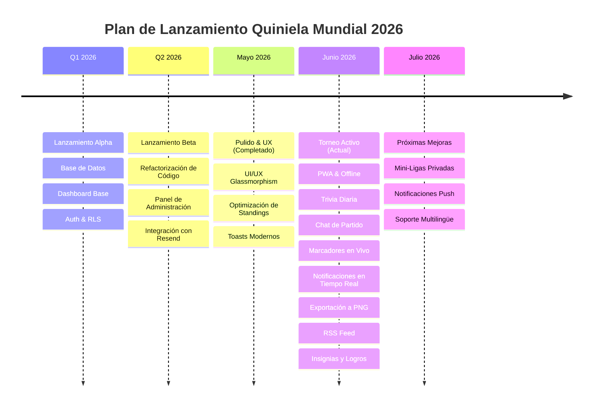

# 🗺️ Roadmap - Quiniela del Mundial 2026

Este documento detalla el mapa de ruta (roadmap) para las próximas mejoras, optimizaciones y adición de nuevas características para la aplicación **Quiniela del Mundial 2026**.

---

## 📅 Línea de Tiempo del Roadmap

---

## ✅ Hitos Completados (Junio 2026)

### 📱 1. Soporte de Aplicación Web Progresiva (PWA)
*   **Estado:** Completado 🚀
*   **Detalles:**
    *   Configuración de `manifest.json` y service worker (`sw.js`) para carga offline.
    *   Iconos de marca diseñados e integrados para compatibilidad con iOS (Apple Touch Icons) y Android.
    *   Flujo e instrucciones para instalar la aplicación directamente en la pantalla de inicio desde Safari (iOS Share) y Chrome (Android).

### 🔔 2. Sistema de Notificaciones en Tiempo Real (In-App)
*   **Estado:** Completado 🚀
*   **Detalles:**
    *   Tabla de `notifications` con políticas RLS para garantizar la privacidad.
    *   Trigger en PostgreSQL para generar notificaciones automáticamente al finalizar cada partido, indicando si el usuario acertó marcador exacto, ganador, empate o si falló.
    *   Notificaciones para el inicio, mantenimiento o ruptura de rachas "On Fire" (multiplicador x1.5).
    *   Componente `NotificationBell` interactivo que se suscribe en tiempo real a Supabase Realtime para recibir alertas instantáneas.

### 🧠 3. Módulo de Trivia Diaria (Gamificación)
*   **Estado:** Completado 🚀
*   **Detalles:**
    *   Trivia interactiva integrada en el Dashboard mediante `TriviaView`.
    *   RPCs seguros en Supabase para evitar filtraciones de respuestas antes de responder.
    *   Banco inicial de 30 preguntas de trivia histórica y del Mundial de la FIFA 2026.
    *   Integración directa de los puntos ganados (+2 por acierto) en el Leaderboard General y por Fases.

### 🖼️ 4. Exportación del Leaderboard y Feed RSS
*   **Estado:** Completado 🚀
*   **Detalles:**
    *   Botón para exportar la tabla de desgloses por fases como imagen PNG usando `html-to-image` y Web Share API para compartir directamente en redes y chats (WhatsApp/Telegram).
    *   Endpoint de RSS `/rss` dinámico con caché optimizada y plantillas HTML para la visualización fluida del fixture y los marcadores de las últimas 48 horas.
    *   Ajuste global a la zona horaria `America/Costa_Rica` (UTC-6) en toda la lógica de negocio y base de datos.

### 💬 5. Muro de Comentarios / Chat de Partido (Social)
*   **Estado:** Completado 🚀
*   **Detalles:**
    *   Esquema de base de datos `match_comments` con políticas RLS y protección de longitud de comentarios.
    *   Trigger en Postgres para asociar comentarios de forma segura a los nombres de usuario basados en su cuenta real de Supabase Auth.
    *   Componente de chat interactivo en tiempo real `MatchChat.tsx` que se suscribe a los canales de Supabase Realtime para recibir y eliminar comentarios al instante.
    *   Integración del chat expandible en `MatchCard.tsx` junto a un contador con efecto bounce dinámico.

### ⚡ 6. Módulo de Marcadores en Vivo (Integración de API)
*   **Estado:** Completado 🚀
*   **Detalles:**
    *   Creado el panel `LiveMatchesView.tsx` consumiendo la API CORS-open pública de `wcup2026.org`.
    *   Soporte para filtros interactivos: En Vivo, Hoy, Próximos y Resultados Recientes.
    *   Auto-polling en segundo plano cada 30 segundos con contador de última sincronización y refresco manual.
    *   Integración de mapeo de banderas y traducción automática de selecciones al español para cohesión de marca.
    *   Ajuste de tiempos de partidos al huso horario local de Costa Rica (`America/Costa_Rica`).

### 🏆 7. Sistema de Insignias y Logros (Gamificación)
*   **Estado:** Completado 🚀
*   **Detalles:**
    *   Diseño y creación de la tabla `user_badges` con políticas RLS y publicación en Supabase Realtime.
    *   Implementación de triggers en PostgreSQL (`trigger_check_prediction_badges`, `trigger_check_trivia_badges`, `trigger_check_social_badges`, `trigger_check_login_badges`) para el cálculo y asignación automatizada de logros al guardar predicciones, contestar trivia, participar en chats o iniciar sesión.
    *   Componente interactivo en tiempo real `BadgeUnlockOverlay.tsx` para animaciones dinámicas al desbloquear insignias.
    *   Sección interactiva de colección de insignias (`viewMode: 'badges'`) que despliega el catálogo completo y el estado de cada logro.

### ⏰ 8. Recordatorios de Predicciones Pendientes (2h & 1h)
*   **Estado:** Completado 🚀
*   **Detalles:**
    *   Creado el endpoint de API `/api/predictions-reminder` seguro con protección mediante token de cron.
    *   Consulta automática de partidos pendientes en ventanas de tiempo de 2 horas (105-135 minutos) y 1 hora (45-75 minutos) antes de su kickoff.
    *   Generación automática de notificaciones in-app de tipo `prediction_reminder_2h` y `prediction_reminder_1h` con control de duplicidad a nivel de partido para evitar alertas repetidas.

### 📊 9. Sabiduría de la Masa (Crowd Wisdom)
*   **Estado:** Completado 🚀
*   **Detalles:**
    *   Implementado el cálculo dinámico de porcentajes acumulados de predicciones (local/empate/visitante) por partido.
    *   Visualización interactiva con barra segmentada de colores en cada `MatchCard.tsx` que muestra en tiempo real la tendencia de la comunidad antes y después de cada kickoff.
    *   Recálculo en caliente al guardar/actualizar el pronóstico del usuario para mantener la tendencia al día.

### 📈 10. Tendencia de Posición en Leaderboard
*   **Estado:** Completado 🚀
*   **Detalles:**
    *   Rediseñado el RPC de base de datos `get_leaderboard()` para calcular el ranking histórico de cada usuario (excluyendo los resultados y trivias del día actual).
    *   Cálculo automático de la diferencia entre el ranking de ayer y el de hoy (`rank_change = yesterday_rank - current_rank`).
    *   Integración de etiquetas visuales en la tabla de clasificación (`app/page.tsx`) que despliegan flechas animadas verdes (`▲`) o rojas (`▼`) con la cantidad de posiciones ganadas/perdidas, o un guión gris (`—`) si no hay cambios.

---

## 🧪 Fase 1.1: Correcciones de UX (Prioridad Máxima - Julio 2026)

*   **Línea de Tiempo:** Principios de Julio 2026
*   **Objetivos:** Resolver los 25 hallazgos críticos, altos y medios de la auditoría UX. Eliminar barreras de entrada para usuarios no técnicos.

### 🔴 Críticos (Resolver primero):
1.  **Refactorizar SPA monolítica:**
    *   Extraer las 11 vistas de `app/page.tsx` (~4674 líneas) en componentes con `ErrorBoundary` o rutas independientes. Priorizar la vista de predicciones como página separada.
2.  **Sincronizar bloqueo de predicciones:**
    *   Cambiar el frontend (`MatchCard.tsx:194`) de 5 minutos a 1 hora para coincidir con el backend (`quiniela_schema.sql`) y la regla documentada. Eliminar el error confuso "servidor rechazó la predicción".
3.  **Validación de email en registro:**
    *   Agregar validación con regex del lado del cliente antes del envío. Mostrar advertencia: "Este correo se usará para recuperar tu cuenta si olvidas la contraseña."
    *   Agregar indicador de normalización a minúsculas en el campo de usuario.

### 🟡 Altos:
4.  **Navegación visible, no oculta en dropdown:**
    *   Mostrar iconos de navegación visibles para las 4 funciones principales (Pronósticos, Calendario, Tabla, Grupos) en el header. Mover el resto a un menú "Más".
    *   Alternativa: Barra de pestañas inferior (tab bar) en móvil.
5.  **Onboarding para nuevos usuarios:**
    *   Modal de bienvenida de 3 pasos al primer inicio tras el registro: "Asigna marcadores → Gana puntos → Compite con tu familia".
    *   Mantener las reglas de puntuación expandidas por defecto para cuentas nuevas.
6.  **Reparar "Cerca de mí" en leaderboard:**
    *   Si el usuario tiene 0 puntos (sin predicciones), en vez de mostrar el Top 10, mostrar mensaje: "Aún no apareces en la tabla. ¡Haz tu primera predicción!"
7.  **Mejorar contraste y legibilidad:**
    *   Aumentar tamaño mínimo de texto informativo de 10px a 11px.
    *   Cambiar `text-slate-400` a `text-slate-300` para etiquetas de formularios y descripciones importantes.

### 🟢 Medios:
8.  **Etiquetar 🎲 como "Aleatorio":**
    *   Agregar texto descriptivo al botón de dado aleatorio en MatchCard: `🎲 Aleatorio` en vez de solo el emoji.
9.  **Simplificar banner PWA:**
    *   Cambiar texto a: "📱 Agrega a tu pantalla de inicio para abrir más rápido y recibir notificaciones."
    *   Botón: "Agregar a pantalla de inicio" en vez de "Instalar App".
10. **Accesibilidad de emojis:**
    *   Agregar `aria-label` a todos los emojis que funcionan como único indicador visual (🎯, 🤝, 🔥, 🏆, etc.).
11. **Mover configuración fuera del avatar dropdown:**
    *   Agregar botón visible "⚙️ Perfil" en el header. Mover notificaciones push y equipo favorito a una página/modal de configuración accesible.
12. **Feedback persistente de guardado:**
    *   Indicar con borde verde y check persistente las predicciones ya guardadas (no solo mensaje de 3 segundos).
13. **Zona horaria visible:**
    *   Mostrar "(Costa Rica, UTC-6)" junto a la hora de cada partido.
14. **Leyenda de siglas en tabla de grupos:**
    *   Agregar `<abbr title="...">` para PJ, PG, PE, PP, GF, GC, DG o leyenda expandible.
15. **Validación visual en inputs de marcador:**
    *   Mostrar advertencia si el marcador supera 10 goles. No permitir valores negativos.

---

## 🚀 Fase 1.2: Próximas Características Sociales y Gamificación (Corto Plazo)

*   **Línea de Tiempo:** Mediados de Julio 2026
*   **Objetivos:** Fomentar la competitividad y la retención del usuario mediante funciones de socialización.

### Características Planificadas:
1.  **Mini-Ligas / Grupos Privados:**
    *   Permitir a los usuarios crear ligas cerradas (por ejemplo: "Colegas de Oficina", "Familia Calderón", etc.) mediante un código de invitación único.
    *   Cada grupo privado tendrá su propia clasificación filtrada en tiempo real.
2.  **Duelos Directos / Cara a Cara (H2H):**
    *   Permitir a los usuarios retar directamente a otro amigo en un partido específico mediante duelos amistosos.
3.  **Menciones en Chat (`@menciones`):**
    *   Envío de notificaciones en tiempo real cuando un usuario sea mencionado en el chat de un partido o del lobby.
4.  **Comodines de Puntuación Doble (Jokers):**
    *   Soporte para 3 comodines por torneo para que el usuario elija duplicar los puntos en partidos estratégicos.

---

## 📱 Fase 2: Canales de Alerta Adicionales (Mediano Plazo)

*   **Línea de Tiempo:** Antes de comenzar la Ronda de 32 (Julio 2026)
*   **Objetivos:** Automatizar los canales de recordatorio de apuestas y alertas push fuera de la app.

### Características Planificadas:
1.  **Bot de Telegram o WhatsApp:**
    *   Integración opcional para recibir alertas de goles en tiempo real, avisos de bloqueo de tiempo y resúmenes diarios de puntuación directo en su app de mensajería favorita.

---

## 🌐 Fase 3: Expansión de Producto (Largo Plazo / Visión a Futuro)

*   **Línea de Tiempo:** Post-Mundial 2026
*   **Objetivos:** Reutilizar la base del software para crear una plataforma multitorneo.

### Características Planificadas:
1.  **Soporte Multilingüe Completo:**
    *   Internacionalización completa (i18n) de la UI para poder alternar de manera instantánea entre Español, Inglés y Francés.
2.  **Quinielas Genéricas / Multitorneo:**
    *   Rediseñar la estructura de base de datos para dar soporte a ligas locales (LaLiga, Champions League, Liga MX, Premier League) u otros torneos mundiales (Copa América, Eurocopa, Mundial Femenino).
